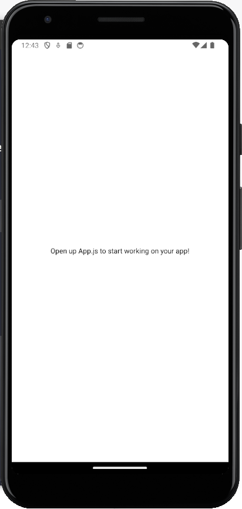
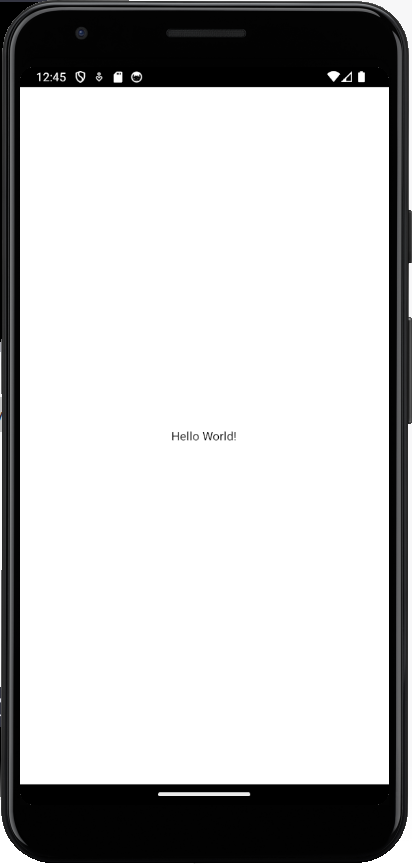
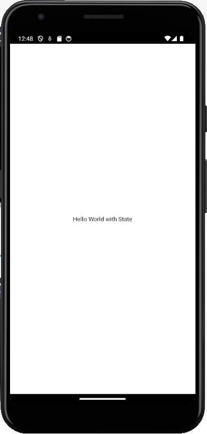
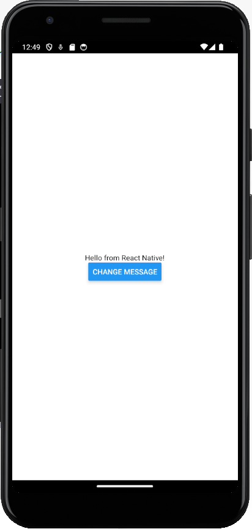
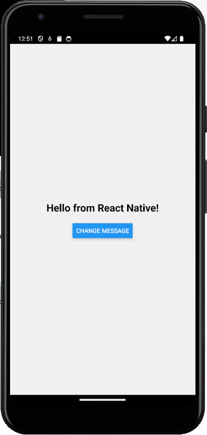
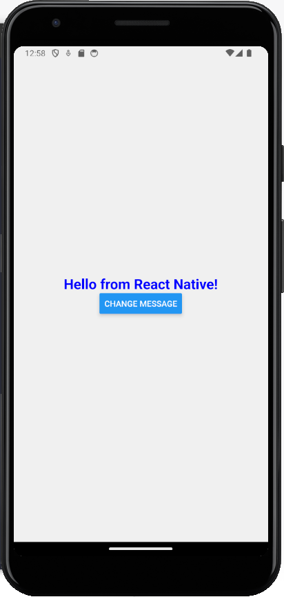

# React Native Basics

## React Native presentation

https://www.slideshare.net/vikrantnegi007/react-native-105102847

## Installation

First, install NodeJS. To be stable, use LTS version

- https://nodejs.org/en/download/current

Follow the URLs below to install dev environment of React Native

- https://reactnative.dev/docs/environment-setup?guide=quickstart

In Android or iOS device, install Expo Go from the App Store or Play Store.

Use the Expo Go to scan the QR code then we can have the application on the mobile device

## Installation with Virtual Machine

Follow the guide below to install needed tools for Virtual Machine

- https://reactnative.dev/docs/environment-setup?guide=native

Then you can use the Virtual Machine to launch the application

## Step 1: Set up the project

Create a new React Native Expo project by running the following command in your terminal and run the application

```
npx create-expo-app comp1786-react-native-basics --template blank
cd comp1786-react-native-basics
npx expo start
```

After that, the application will be started



## Step 2: Hello World App

Now that your project is set up, let's create a simple Hello World app.

Open the App.js file in your code editor.

Replace the content of App.js with the following code:

```js
import React from "react";
import { View, Text } from "react-native";

export default function App() {
  return (
    <View style={{ flex: 1, justifyContent: "center", alignItems: "center" }}>
      <Text>Hello World!</Text>
    </View>
  );
}
```

Save the file, and you'll see the changes automatically reflected in the Expo Developer Tools in your web browser. Your Hello World app is now ready!



## Step 3: Adding State

Next, let's add state to our app to make the message dynamic.

First, we need to import useState from React at the top of App.js:

```jsx
import React, { useState } from "react";
```

Replace the App component code with the following:

```jsx
import { React, useState } from "react";
import { Text, View } from "react-native";

export default function App() {
  const [message, setMessage] = useState("Hello World with State");

  return (
    <View style={{ flex: 1, justifyContent: "center", alignItems: "center" }}>
      <Text>{message}</Text>
    </View>
  );
}
```

Save the file, and you'll see the same "Hello World with State" message.



To make the message dynamic, let's add a button below the text to change it when pressed:

```jsx
import { React, useState } from "react";
import { Button, Text, View } from "react-native";

export default function App() {
  const [message, setMessage] = useState("Hello World!");

  const changeMessage = () => {
    setMessage("Hello from React Native!");
  };

  return (
    <View style={{ flex: 1, justifyContent: "center", alignItems: "center" }}>
      <Text>{message}</Text>
      <Button title="Change Message" onPress={changeMessage} />
    </View>
  );
}
```

Save the file, and you'll see a button that changes the message when pressed.



## Step 4: Adding Styling

Finally, let's add some styling to make our app visually appealing.

In App.js, update the View style to add a background color and padding:

```js
import { React, useState } from "react";
import { Button, Text, View } from "react-native";

export default function App() {
  const [message, setMessage] = useState("Hello World!");

  const changeMessage = () => {
    setMessage("Hello from React Native!");
  };

  return (
    <View style={styles.container}>
      <Text style={styles.text}>{message}</Text>
      <Button title="Change Message" onPress={changeMessage} />
    </View>
  );
}

const styles = {
  container: {
    flex: 1,
    justifyContent: "center",
    alignItems: "center",
    backgroundColor: "#f0f0f0",
    padding: 20,
  },
  text: {
    fontSize: 24,
    fontWeight: "bold",
    marginBottom: 20,
  },
};
```

Save the file, and you'll notice the changes in the Expo Developer Tools. Your app now has a styled background color, text, and button.



## Step 5: Create a Custom Component

Let's create a custom component for our greeting message. This will allow us to reuse the same greeting message in multiple places.

In the project's root folder, create a new folder called components.

Inside the components folder, create a new file called Greeting.js.

Open Greeting.js in your code editor and define the custom component:

```js
// Gretting.js
import React from "react";
import { View, Text } from "react-native";

const Greeting = ({ message }) => {
  return (
    <View style={{ alignItems: "center" }}>
      <Text style={{ fontSize: 24, fontWeight: "bold" }}>{message}</Text>
    </View>
  );
};

export default Greeting;
```

## Step 6: Use the Custom Component

Now that we have our custom Greeting component, let's integrate it into our main App.js.

Open App.js in your code editor.

Import the Greeting component at the top of the file:

```js
import React, { useState } from "react";
import { View, Button } from "react-native";
import Greeting from "./components/Greeting";
```

Replace the existing Text component with the Greeting component:

```js
export default function App() {
  const [message, setMessage] = useState("Hello World!");

  const changeMessage = () => {
    setMessage("Hello from React Native");
  };

  return (
    <View style={styles.container}>
      <Greeting message={message} />
      <Button title="Change Message" onPress={changeMessage} />
    </View>
  );
}
```

## Step 7: Using Props

Props allow us to pass data from a parent component (App) to a child component (Greeting).

In Greeting.js, we defined a prop called message. This prop will hold the greeting message we want to display in the Greeting component.

In App.js, we passed the message state to the Greeting component as a prop.

Now, let's make the Greeting component more dynamic by adding another prop called style to customize the text's appearance.

Update Greeting.js:

```js
import React from "react";
import { View, Text } from "react-native";

const Greeting = ({ message, style }) => {
  return (
    <View style={{ alignItems: "center" }}>
      <Text style={[{ fontSize: 24, fontWeight: "bold" }, style]}>
        {message}
      </Text>
    </View>
  );
};

export default Greeting;
```

With this change, you can now pass additional styles to the Greeting component when using it in App.js:

```js
export default function App() {
  const [message, setMessage] = useState("Hello World!");

  const changeMessage = () => {
    setMessage("Hello from React Native!");
  };

  return (
    <View style={styles.container}>
      <Greeting message={message} style={{ color: "blue" }} />
      <Button title="Change Message" onPress={changeMessage} />
    </View>
  );
}
```

Now, when you run the app, you'll see that the Greeting component's text is styled with the additional color passed as a prop.


